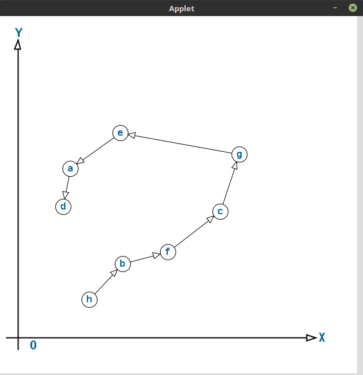

# README #

# clojureでAI

## neural-network/sperceptron.clj (単純パーセプトロン)

## ga/find-opt-path.clj (遺伝的アルゴリズムで巡回セールスマン問題の近似解を求める)

```
[quil "2.4.0"]
[org.clojure/math.numeric-tower "0.0.4"]
[org.clojure/core.match "0.3.0-alpha4"]

```

```
user=> (load-file "find-opt-path.clj")
#'ai.ga/execute-example
user=> (ai.ga/execute-example)
{:a [8 20], :b [61 22], :c [96 13], :d [83 49], :e [37 13], :f [51 20], :g [32 79], :h [15 58]}
#'ai.ga/skt1
```

### 実行例など

