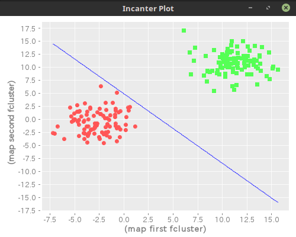

# README #

# clojureでAI

## neuralnetwork/sperceptron.clj (単純パーセプトロン)

### 使用パッケージ
```
[incanter "1.5.7"]
```


### 実行方法など

実行例
```
user=> (load-file "sperceptron.clj")
#'ai.neuralnetwork/generate-sample-cluster
user=> (ai.neuralnetwork/sperceptron [(generate-sample-cluster 1 0 2 100)
                               (generate-sample-cluster 10 9 2 100)])
  #_=> [(3.389737793200027 2.185534928680564) -23.132321256349435]

```


学習に成功する例
```
(ai.neuralnetwork/sperceptron [(generate-sample-cluster -4 -2 2 100)
                               (generate-sample-cluster 10 9 2 100)])
```


学習に失敗する例
```
(ai.neuralnetwork/sperceptron [(generate-sample-cluster 4 2 2 100)
                               (generate-sample-cluster 8 7 2 100)])
```


## ga/find-opt-path.clj (遺伝的アルゴリズムで巡回セールスマン問題の近似解を求める)

### 使用パッケージ
```
[quil "2.4.0"]
[org.clojure/math.numeric-tower "0.0.4"]
[org.clojure/core.match "0.3.0-alpha4"]

```

### 実行方法など
```
user=> (load-file "find-opt-path.clj")
#'ai.ga/execute-example
user=> (ai.ga/execute-example)
{:a [8 20], :b [61 22], :c [96 13], :d [83 49], :e [37 13], :f [51 20], :g [32 79], :h [15 58]}
#'ai.ga/skt1
```

### 実行結果例

